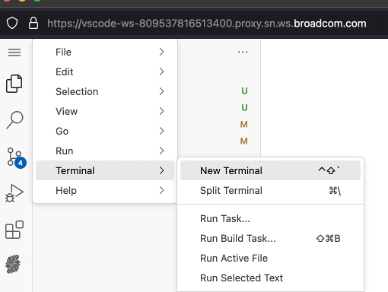
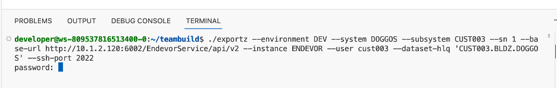
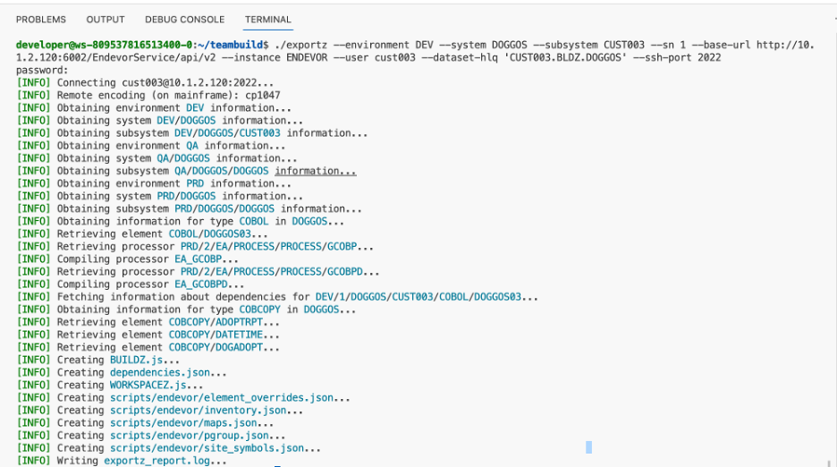
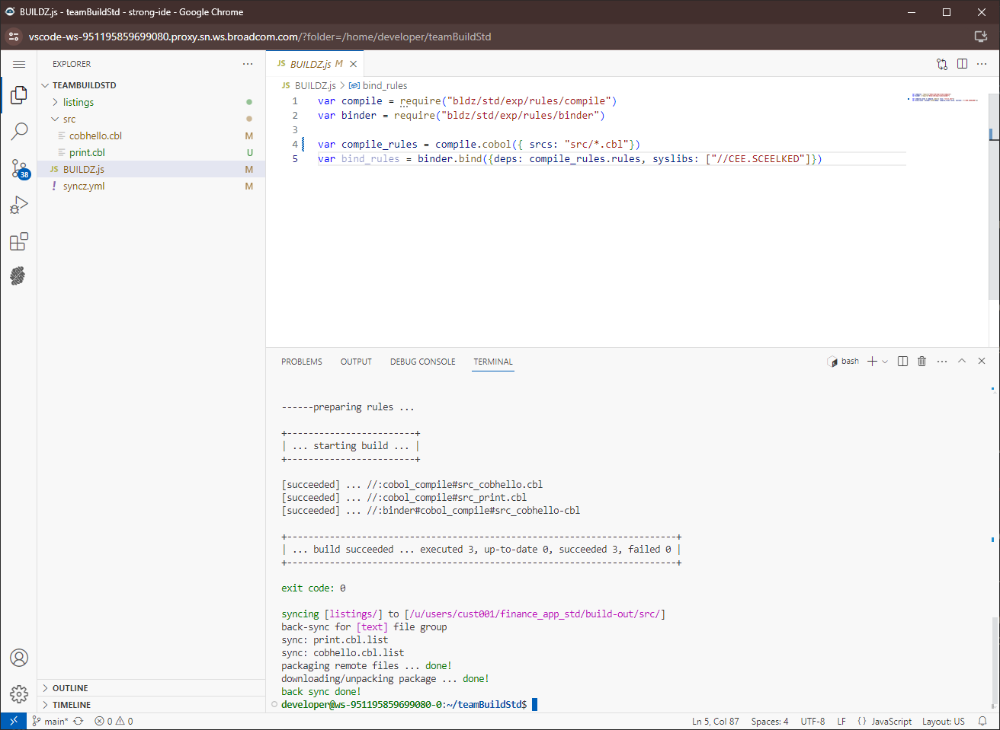

# Team Build Workshop Scenario 

## Getting Started

1. Login the workshop system using the given URL, username and password.
2. You are in the secure cloud environment which runs VS Code and is connected to the Mainframe.
3. Launch the workspace **Team Build Scenario 1**

## Exporting a Build Script from Endevor (Scenario 1)

**Step 1:**       

Open a terminal window by selecting the three horizontal lines on the top left (Burger Icon) -> Terminal -> New Terminal         

Reference screenshot:              


**Step 2:** 

Copy paste the below command in the terminal

./exportz --environment DEV --system DOGGOS --subsystem CUST0## --sn 1 --base-url http://10.1.2.120:6002/EndevorService/api/v2  --instance ENDEVOR --user cust0## --dataset-hlq 'CUST0##.BLDZ.DOGGOS' --ssh-port 2022

**Important Notes:**          
a). Replace ## in the above command with your User ID number.       
b). The command run will prompt for a password. Enter the Password.             

Both the User ID number and Password will be shared by the instructor.          

Here are a couple examples:          

Example 1:       
If you are assigned User 03, then replace ## with 03 and the command will look like below:          

./exportz --environment DEV --system DOGGOS --subsystem CUST003 --sn 1 --base-url http://10.1.2.120:6002/EndevorService/api/v2  --instance ENDEVOR --user cust003 --dataset-hlq 'CUST003.BLDZ.DOGGOS' --ssh-port 2022        

Example 2:       
If you are assigned User 21, then replace ## with 21 and the command will look like below:          

./exportz --environment DEV --system DOGGOS --subsystem CUST021 --sn 1 --base-url http://10.1.2.120:6002/EndevorService/api/v2  --instance ENDEVOR --user cust021 --dataset-hlq 'CUST021.BLDZ.DOGGOS' --ssh-port 2022  

Reference screenshots: 





**Step 3:** 

Copy paste the below command in the terminal

./syncz -a "src::bldz --proc 1"       

Reference screenshots: 


## Creating a Build Script from Scratch (Scenario 2)

**Step 1:**       

1. Go back to the Strong Network workspaces window and launch the workspace **Team Build Scenario 2**      
2. Make sure the initial build process has successfully completed. (**exit code: 0** message in the active terminal)  
3. Close the terminal from it's right top corner  

**Step 2:**

1. Click on the 3 horizontal lines at the top left of the window (the 'Hamburger' icon)   
2. Select File > Open Folder    
3. Navigate to /home/developer/teamBuildStd (choose 'teamBuildStd' from the dropdown list that appears and click 'OK')    
4. Expand the Explorer view (first icon under the 'Hamburger' icon on the top left)  
5. Locate the BUILDZ.js file list treeview and double click to edit it.  It should be an empty file.  
6. First, we need to add in the required Standard Library includes.  Add the following 2 lines:   
        var compile = require("bldz/std/exp/rules/compile")
        var binder = require("bldz/std/exp/rules/binder")    
7. Now we will direct the script to compile all the COBOL in the src folder.  Add the following line:   
        var compile_rules = compile.cobol({ srcs: "src/*.cbl"})    
8. The script creates rules, which we can use as a dependency for the binder to create a load module.  Add the following line to the script:
        var bind_rules = binder.bind({deps: compile_rules.rules, syslibs: ["//CEE.SCEELKED"]})    
9. Save the BUILDZ.js file (Hamburger Icon > File > Save)   
10. Now we will test our new build script.  Open a new terminal window (Hamburger Icon > Terminal > New Terminal)     
11. Run the ```syncz -a "src::bldz --proc 1"``` command to compile the application.
12. If all goes well, you should see the compilation output in the terminal with a message indicating all complies succeeded.  Congratulations!  You have created a simple build script with only 4 lines of code!  If you wish to review the listings, they will have synchronized back to your workspace in the **listings** directory.  

Reference screenshot: 

